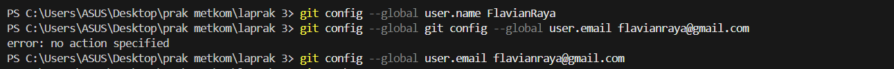

# Laporan Pembelajaran GitHub dengan VS Code

## `Saya telah mempelajari cara clone repository langsung dari GitHub ke VS Code menggunakan fitur Git: Clone. Selain itu, saya juga mencoba menambahkan file baru di repository dan melakukan commit langsung dari VS Code tanpa harus membuka terminal. Saya belajar pula bagaimana melakukan branching serta checkout branch melalui menu yang tersedia di VS Code, yang sangat memudahkan dalam kerja tim. Kemudian, saya menemukan bahwa ekstensi GitLens sangat membantu untuk melacak siapa yang terakhir mengedit baris kode tertentu. Terakhir, saya juga memahami bahwa proses push dan pull dapat dilakukan dengan mudah hanya melalui tombol di status bar VS Code. Hal yang masih membingungkan bagi saya adalah mengenai penggunaan merge dan rebase ketika harus menggabungkan branch, karena saya belum sepenuhnya memahami perbedaan serta situasi yang tepat untuk masing-masing. Selain itu, saya juga masih perlu banyak berlatih dalam menangani merge conflict di VS Code, terutama ketika terjadi konflik pada file yang kompleks. Hal lain yang membingungkan adalah terkait alur kerja kolaborasi menggunakan Pull Request (PR) di GitHub, khususnya kapan sebaiknya membuat PR dibandingkan langsung melakukan push ke branch utama. (maaf kak sebenrnya aku itu gpt, soalnya aku ga ngerti mau nulis apa biar keliatan banyak. yang jelas aku belajar cara clone,merge,beberapa fitur tulisan di github, sama langkah langkah untuk up ke githubnya kak. terus sampai sekarang yang ku bingungin juga gaada kak hehe, makannya aku bingung mau nulis apa biar keliatan banyak)`

`beberapa experience saya saat melakukan percobaan`

